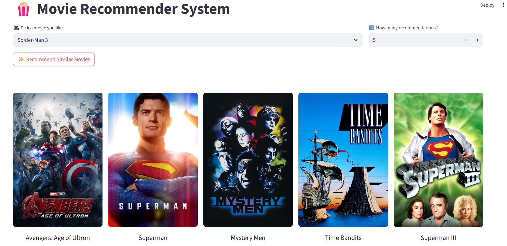

# 🎬 Movie-Recommender-System
## 📘 Overview
This is a **content-based movie recommender system**, built in *February 2025*, that leverages **natural language processing (NLP) techniques** to suggest movies based on user preferences.

The recommendation engine uses a combination of:

- **CBOW (Continuous Bag of Words)** for **semantic understanding** of movie metadata
- **Cosine similarity** for matching movie vectors
- **User rating data** as an additional dimension in the vector space

It features a **Streamlit-powered web interface**, where users can interactively select a movie and receive personalized recommendations, complete with **posters fetched using the TMDb API**.

## 📌 Problem Statement
Recommending movies based on user preferences is a key component in modern entertainment platforms. However, collaborative filtering methods often struggle when user interaction data is sparse or unavailable. To overcome this limitation, this project focuses on content-based recommendations, leveraging textual metadata (such as genre, cast, and overview) and enriching it with user ratings to deliver relevant and personalized movie suggestions — even for new or anonymous users.

**Goal:**
To build an efficient, NLP-powered content-based recommender system that combines semantic similarity and user sentiment (ratings) to suggest top-N similar movies for any selected input title, delivered through an intuitive Streamlit web app.

## 💡 Features
- 🔍 Content-based NLP-driven recommendations
- ⭐ Rating-aware ranking
- 🖼️ Movie posters using TMDb API
- 🖥️ Responsive and clean UI
- 🔢 Adjustable number of recommendations

## 🖼️ User Interface Preview
Here’s a look at the interactive Streamlit interface:



## ⚙️ Getting Started

This project requires Python and some common data science libraries. Setup is straightforward with a requirements.txt to install all dependencies.

### ✅ Requirements

- **Python 3.8+**
- Libraries listed in **requirements.txt**

[->install python](https://www.python.org/downloads/)

### 🚀 Running the System

```bash
# Clone the repository
git clone https://github.com/KDitsa/Movie-Recommender-System.git
cd Movie-Recommender-System

# (Optional) Create and activate a virtual environment
python -m venv <your_environment_name>
<your_environment_name>\Scripts\activate # For Windows

# Install dependencies
pip install -r requirements.txt

# Run the Streamlit app
streamlit run app.py
```

Once running, the app will open by default in your browser at http://localhost:8501, where you can input your data and get price predictions instantly.


## 🧠 Core Approach
### 1. 🔄 Dataset Integration & Preprocessing
- **Merged** two complementary datasets:
    - One containing `movie_id`, `title`, `cast`, `crew`.
    - Another with extensive metadata: `genres`, `keywords`, `overview`, `vote_average`, `vote_count`, etc.
    - Performed a **inner join on the `id`** column and retained only relevant fields: `id`, `title`, `genres`, `keywords`, `overview`, `vote_average`, `vote_count`, `cast`, `crew`.
    - **Dropped 3 rows** with missing `overview`, as they were few and wouldn't affect model quality.

---

### 2. 🧹 Data Cleaning & Feature Engineering
- Parsed and extracted:
    - **Genre names** (e.g., “Action”, “Drama”) from `genre`
    - **Top 5 cast members** from `cast`
    - **Director name** from `crew`
- **Maintained meaningful multi-word phrases** (e.g., actor names like "Brad Pitt" or genre terms like "science fiction") by removing unnecessary spaces and ensuring they remain as single, intact units. This prevents misleading token overlaps (e.g., confusing “Brad Pitt” with “Brad Johnson” or treating “science” and “fiction” as unrelated), preserving the semantic integrity of important terms and improving recommendation quality.
- Calculated **weighted rating** using IMDb’s formula to factor in both average rating and number of votes:

  $$
  \text{Weighted Rating} = \left( \frac{v}{v + m} \right) R + \left( \frac{m}{v + m} \right) C
  $$

  Where:

  * *v* = number of votes for the movie
  * *m* = minimum votes required
  * *R* = average rating of the movie
  * *C* = mean vote across the dataset

- Combined `overview`, `genres`, `keywords`, `cast`, and `crew` into a single **`description`** field for semantic analysis.
- Final cleaned dataset:
  `id`, `title`, `weighted_rating`, `description`.

---

### 3. 🧠 NLP-Based Modeling (CBOW)
- Applied **Natural Language Processing** techniques to the `description`:
    - **Lowercased** text
    - **Removed punctuation and stopwords**
    - **Tokenized** and **lemmatized** words
- Trained a **CBOW (Continuous Bag of Words)** model using `CountVectorizer` to convert movie descriptions into feature vectors.
- Computed **average vector embeddings** for each movie's description.

---

### 4. 🎯 Hybrid Feature Vector
- **Combined the weighted rating** with the **CBOW-based description vector** to create a **hybrid movie representation** such that movies with similar content and higher ratings are ranked higher.
- This enriches similarity calculations with both **textual content** and **audience perception** (via rating).

---

### 5. 🔍 Similarity & Recommendation Logic
- Computed **cosine similarity** between all movie vectors.
- Developed a `recommend()` function that:
    - **Locates** the selected movie.
    - Finds the **top-N most similar movies** based on cosine similarity.

---

### 6. 🌐 Deployment via Streamlit
- Designed a sleek **Streamlit interface** where users can:
    - Select a movie from a dropdown list.
    - Specify the number of recommendations they want.
    - View **movie posters** and **titles** in a horizontal layout.
    - Posters are dynamically fetched using the **TMDb API**, giving the app a rich visual experience.

---

## ✨ Future Enhancements
- Add genre filters to narrow recommendations
- Implement hybrid filtering using collaborative data
- Use BERT embeddings or Doc2Vec for better text understanding
- Add movie trailers alongside posters

## 📝 Closing Thoughts
This project demonstrates how combining cleaned movie metadata with NLP techniques like CBOW and cosine similarity can create an effective content-based recommendation system. By preserving meaningful entities and integrating user ratings, we ensure recommendations are both context-aware and user-relevant—ensuring it remains effective even for new users with limited data (cold-start scenarios).
